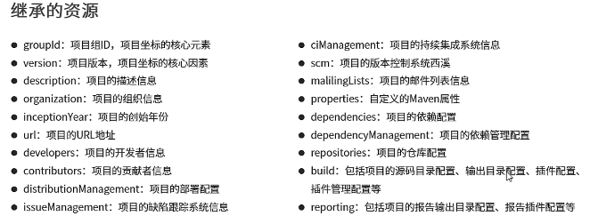

# Maven

## 是什么

Maven的本质是一个项目管理工具，将项目开发和管理过程抽象成一个项目对象模型（POM）

## 作用

1. 项目构建
2. 依赖管理
3. 统一开发结构

## 基本概念

### 仓库

用于存储资源，包含各种jar包

1. 远程仓库
   1. 中央仓库
   2. 私服
2. 本地仓库

### 坐标

|组成|说明|
|-|-|
|groupId|当前Maven项目隶属组织名称|
|artifactId|当前maven项目名称|
|version|当前项目版本号|
|packaging(*不属于坐标*)|打包方式|

mvn仓库 <https://mvnrepository.com/>

## 构建

### 目录结构

### 命令

```mvn
mvn compile #编译
mvn clean #清理
mvn test #测试
mvn package #打包
mvn install #安装到本地仓库
```

项目模板  `mvn archetype:generate`

## 依赖管理

### 依赖有传递性

1. 直接依赖
2. 间接依赖

### 冲突问题

- 路径优先 层级浅优先
- 声明优先 配置顺序考前优先
- 特殊优先 同级后配置优先

### 可选依赖

隐藏当前依赖——不透明

```xml
<optional>true</optional>
```

### 排除依赖

主动断开依赖资源，被排除的资源无需指定版本——不需要

```xml
<exclusions>
    <exclusion>
        <groupId></groupId>
        <artifactId></artifactId>
    </exclusion>
</exclusions>
```

### 依赖范围

依赖的jar默认情况可以在任何地方使用，使用`<scope>`标签

#### 范围

|scope|mian|test|package|
|-|-|-|-|
|compile|Y|Y|Y|
|test||Y||
|provided|Y|Y||
|runtime|||Y|

依赖范围传递性

|间接依赖\直接依赖|compile|test|provided|runtime|
|-|-|-|-|-|
|compile|compile|test|provided|runtime|
|test|||||
|provided|||||
|runtime|runtime|test|provided|runtime|

## 声明周期

1. clean
2. default
3. site

## 插件

```xml
<build>
    <plugins>
        <plugin>
            <groupId></groupId>
            <artifactId></artifactId>
            <version></version>
            <configuration>
            <port>/<port>
            <path></path>
            </configuration>
        </plugin>
    </plugins>
</build>

```
 
## 聚合

多模块构建维护

```xml
<!--定义该工程用于惊醒构建管理-->
<packaging>>pom</packaging>

<!--管理的项目-->
<modules>
    <module></module>
<modules>
```

聚合模块的执行顺序跟模块的依赖关系有关

## 继承

实现在子工程沿用父工程中配置,在子工程中无需声明依赖版本

```xml
<!--定义该工程的父工程-->
<parent>
    <groupId></groupId>
    <artifaotId></artifaotId>
    <version></version>
    <!--填写父工程POM文件-->
    <relativePath></relativePath>
</parent>
```

```xml
<!--声明此处进行依赖管理-->
<dependencyManagement>
    <dependncies>
        <denpedncy>
            <groupId></groupId>
            <artifaotId></artifaotId>
            <version></version>
        </denpedncy>
    </dependncies>
</dependencyManagement>
```



## 属性

类别

1. 自定义属性

    ```xml
    <properties>
        <sprign.version></sprign.version>
    </properties>
    ```

2. 内置属性
3. setting属性
4. Java系统属性
5. 环境变量属性

### 资源配置

配置文件加载pom文件中定义属性

```xml
<resources>
    <resource>
        <!--配置文件目录，可以使用属性动他加载${project.basedir}-->
        <directory></directory>
        <!--开启对配置文件的资源加载-->
        <filtering></filtering>
    </resource>
</resources>
```

使用属性`${}`

## 版本管理

1. SNAPSHOT(快照版本)
2. RELEASE(发布版本)

版本号的约定

`<主版本>.<次版本>.<增量版本>.<里程碑版本>`

## 多环境开发配置

```xml
<!-创建多环境->
<profiles>
    <profile>
        <id>dep_env</id>
        <properties>
            <sprign.version></sprign.version>
        </properties>
        <!--默认启动-->
        <activeByDefault>ture</activeByDefault>
    </profile>
</profiles>
```

```mvn
mvn install -P _env
```

## 跳过测试

IDEA界面

命令
`-D skipTests`

配置

```xml
<plugin>
    <artifactId>maven-surefire-plugin</artifactId>
    <version></version>
    <!--1.设置跳过测试-->
    <configuration>ture</configuration>
    <!--2.指定测试,指定的文件-->
    <configuration>
        <includes>
            <include>
            </include>
        </includes>
        <excludes>
            <exclude>
            </exclude>
        </excludes>
    </configuration>
</plugin>
```

## 私服

nexus

1. 宿主仓库 hosted
2. 代理仓库 proxy
3. 仓库组 group

