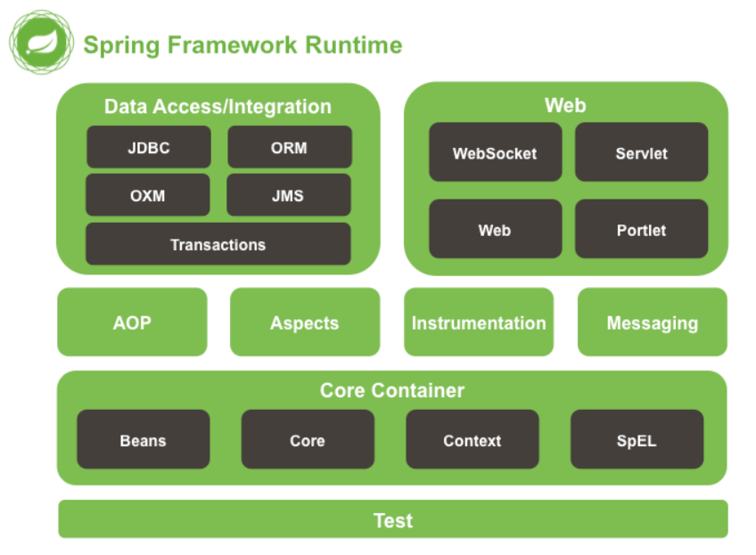
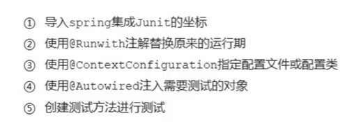
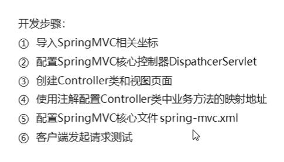
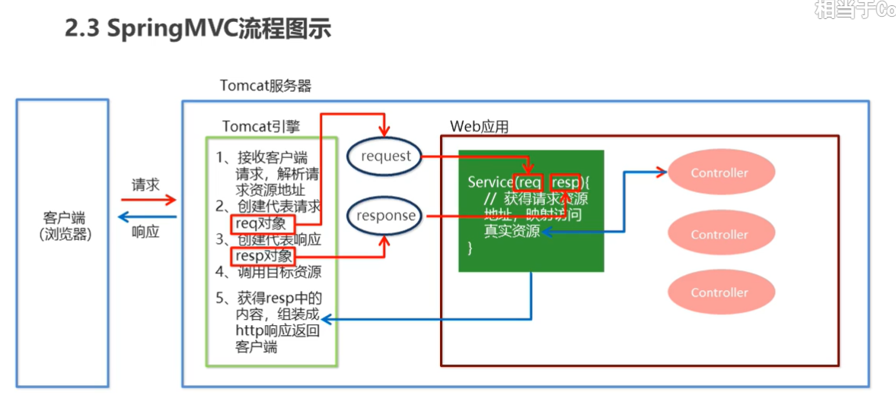
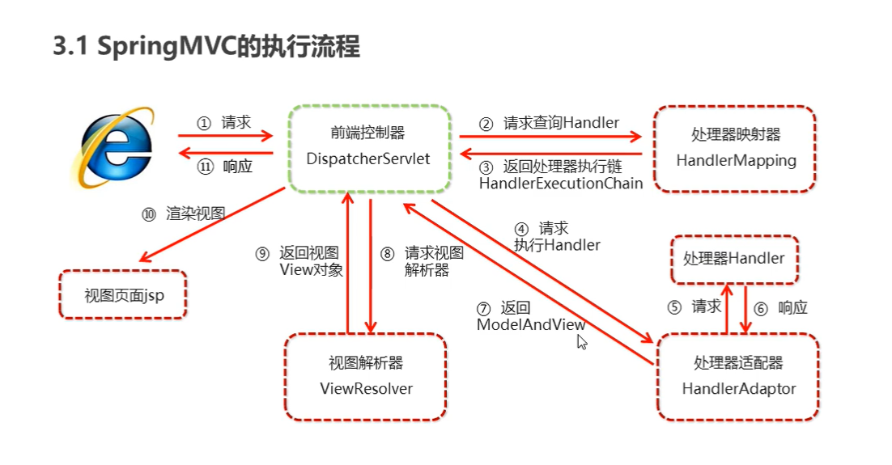

# SSM

## 1.spring

full-stack 代表各层都有解决方案

1. IoC (Inverse Of Control)反转控制
2. AOP (Aspect Oriented Programming)面向切面编程



TODO  lombok var 

### 开发步骤

1. 导入坐标
2. 创建Bean
3. 创建applicationContext.xml
4. 配置配置文件
5. 船舰applicationContext对象getBean

## 2.spring配置文件

### scope 指定对象范围

|取值范围|说明|创建时机|生命周期:对象创建-对象运行-对象销毁|
|-|-|-|-|
|singleton|默认、单例的|spring核心文件被加载时|对象创建：应用加载容器，创建容器时，对象就被创造了<br>对象运行：只要容器存在就一直存在 <br> 对象销毁：应用卸载，销毁容器时，对象就被销毁了|
|prototype|多例的|调用getBean()实例化Bean|对象创建：当使用对象时，创造新的实例<br>对象运行：只要只要使用就一直存在<br>对象销毁：长时间不用，被java的垃圾回收|
|request|WEB项目中，spring创建一个Bean对象，将对象存入request域|||
|session|WEB项目中，spring创建一个Bean对象，将对象存入session域|||
|global session|WEB项目中，应用在Portlet环境，如果没有PortLet环境，globalSession相当于session|||

### 生命周期配置

`init-method` 指定初始化方法
`destyroy-method` 指定销毁方法

### Bean实例化三种方式

1. 无参构造方法实例化
2. 工厂静态方法实例化

```xml
<bean id="" class=""  factory-method=""></bean>
```

3. 工厂实例方法实例化

```xml
<bean id="" factory-bean=""  factory-method=""></bean>
```

### 依赖注入

IOC解耦只是降低他们的依赖关系，但不会消除，依赖关系由spring维护

方式

1. 构造方法
2. set方法

注入的数据类型

1. 普通数据类型 `value=`
2. 引用数据类型
3. 集合数据类型

```xml
 <property name="strList" >
            <list>
                <value>aa</value>
            </list>
        </property>
        <property name="userMap">
            <map>
                <entry key="user1" value-ref="user"></entry>
            </map>
        </property>
            <property name="properties">
                <props>
                    <prop key="p1">pppp1</prop>
                    <prop key="p2">2</prop>
                </props>
            </property>
    </bean>
```

TODO property

#### set方法注入

```xml
<property name="userDao" ref="userDao"></property>
```

`name`标签是首字母小写的seter

引入p命名空间

```xml
xmlns:p="http://www.springframework.org/schema/p"

<bean id="userService" class="org.example.service.impl.UserServiceImpl" p:userDao-ref="userDao"/>
```

#### 构造方法

```xml
<bean>
<constructor-arg name="userDao1" ref="userDao"></constructor-arg>
</bean>
```

### 引入其他配置文件

```xml
<import resource=""/>
```

## 3.spring相关api

1. ClassPathXmlApplicationContext
2. FileSystemXmlApplicationContext
3. AnnotationConfigApplicationContext

getBean()

1. id
2. Class< T >

## 4.spring配置数据源

常见数据源（连接池）DBCP、C3P0、BoneCP、Druid

硬编码

```java
        ResourceBundle rb = ResourceBundle.getBundle("jdbc");
        String driver = rb.getString("jdbc.driver");
        DruidDataSource dataSource = new DruidDataSource();
        dataSource.setDriverClassName(driver);
        dataSource.setUrl();
        dataSource.setUsername();
        dataSource.setPassword();
        DruidPooledConnection connection = dataSource.getConnection();
        connection.close();
```

POM

```xml
        <dependency>
            <groupId>com.alibaba</groupId>
            <artifactId>druid</artifactId>
            <version>1.2.8</version>
        </dependency>
        <dependency>
            <groupId>mysql</groupId>
            <artifactId>mysql-connector-java</artifactId>
            <version>8.0.28</version>
        </dependency>
```

配置文件

```xml
 <beans  xmlns:context="http://www.springframework.org/schema/context"
        xsi:schemaLocation="http://www.springframework.org/schema/context http://www.springframework.org/schema/context/spring-context.xsd">

        <context:property-placeholder location="classpath:db.properties"/>

    <bean id="d" class="com.alibaba.druid.pool.DruidDataSource">
        <property name="driverClassName" value="${jdbc.driver}"/>
        <property name="url" value="${jdbc.url}"/>
        <property name="username" value="${jdbc.username}"/>
        <property name="password" value="${jdbc.password}"/>
    </bean>

</beans>
```

```java
        ApplicationContext app = new ClassPathXmlApplicationContext("applicationContext.xml");
        DruidDataSource dataSource = (DruidDataSource) app.getBean(DataSource.class);

        System.out.println(dataSource);
        System.out.println(dataSource);
        try {
            DruidPooledConnection connection =  dataSource.getConnection();
            System.out.println(connection);
            connection.close();
        } catch (SQLException e) {
            throw new RuntimeException(e);
        }
```

*dataSource是接口*

```properties
jdbc.driver=com.mysql.cj.jdbc.Driver
jdbc.url=jdbc:mysql://localhost:3306
jdbc.username=fuhua
jdbc.password=11057
```

*一定要加jdbc，要么识别不出来在xml*

## 5.spring 注解开发

### 原始注解

主要代替`<bean>`配置

|注解|说明|
|-|-|
|@Component|使用在类上实例化Bean|
|@Controller|使用在web层类上实例化Bean|
|@Service|使用在Service层类上实例化Bean|
|@Repository|使用在dao层类上实例化Bean|
|@Autowired|使用字段上用于根据类型依赖注入|
|@Qualifier|结合@Autowired一起使用，用于根据名称进行依赖注入|
|@Resouce|相当于@Autowired+@qualifier，按照名称进行注入|
|@Value|注入普通属性|
|@Scope|标注Bean的作用范围|
|@PostConstruct|初始化方法|
|@PreDestroy|销毁方法|

配置组件扫描

```xml
<context:component-scan base-package="edu.ccit"/>
```

### 新注解

|注解|说明|
|-|-|
|@Configuration|当前为一个spring配置类|
|@ComponentScan|用于指定要扫描的包|
|@Bean|使用在方法上，标注该类的返回值到spring容器中|
|@PropertySource|加载.properties文件中的配置|
|@Import|用于导入其他配置类|

```java
ApplicationContext applicationContext = new AnnotationConfigApplicationContext(SpringConfiguration.class);
```

## 5.Junit

SpringJunit负责创建Spring容器，需配置配置文件
将测试Bean直接注入



```java
@RunWith(SpringJUnit4ClassRunner.class)
@ContextConfiguration(classes = SpringConfiguration.class)//("*.xml")
```

POM

```xml
        <dependency>
            <groupId>org.springframework</groupId>
            <artifactId>spring-test</artifactId>
            <version>5.3.18</version>
        </dependency>
```

## 6.SpringWEB

```xml
<listener>
<listener-class>org.springframework.web.context.ContextLoaderListener</listener-class>
</listener>
```

```java
WebApplicationContext webApplicationContext = WebApplicationContextUtils.
System.out.println(webApplicationContext);
UserService bean = webApplicationContext.getBean(UserService.class);
```

## 7.springMVC

开发步骤



springmvc流程图



web.xml

```xml
  <servlet>
    <servlet-name>DispatcherServlet</servlet-name>
    <servlet-class>org.springframework.web.servlet.DispatcherServlet</servlet-class>
    <load-on-startup>1</load-on-startup>
    <init-param>
      <param-name>contextConfigLocation</param-name>
      <param-value>classpath:spring-mvc.xml</param-value>
    </init-param>
  </servlet>
  <servlet-mapping>
    <servlet-name>DispatcherServlet</servlet-name>
    <url-pattern>/</url-pattern>
  </servlet-mapping>
```

扫描组件

```xml
<!--1-->
<context:component-scan base-package="edu.ccit.controller"/>
<!--2-->
<context:component-scan base-package="edu.ccit.controller">
    <context:exclude-filter type="annotation" expression="org.springframework.stereotype.Controller"/>
</context:component-scan>
```



### SMVC注解解析

`@RequestMapping`映射注解

视图解析配置

`forward` 转发
`redirect` 重定向

配置内部资源视图解析器

```xml
<bean id="viewResolver" class="org.springframework.web.servlet.view.InternalResourceViewResolver">
    <property name="prefix" value="/jsp/"></property>
    <property name="suffix" value=".jsp"></property>
</bean>
```

### springMVC数据响应方式

1. 页面跳转
   1. 直接返回字符串
   2. 通过ModelAndView对象返回
2. 回写数据
   1. 直接返回字符串
   2. 返回对象或集合

TODO fastjson